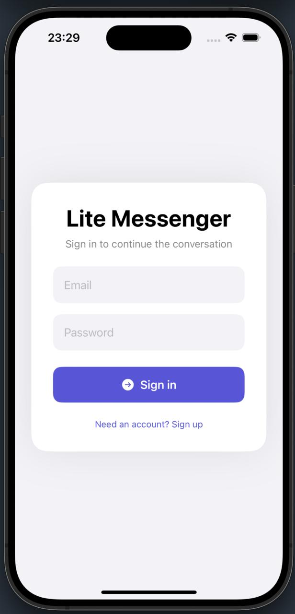
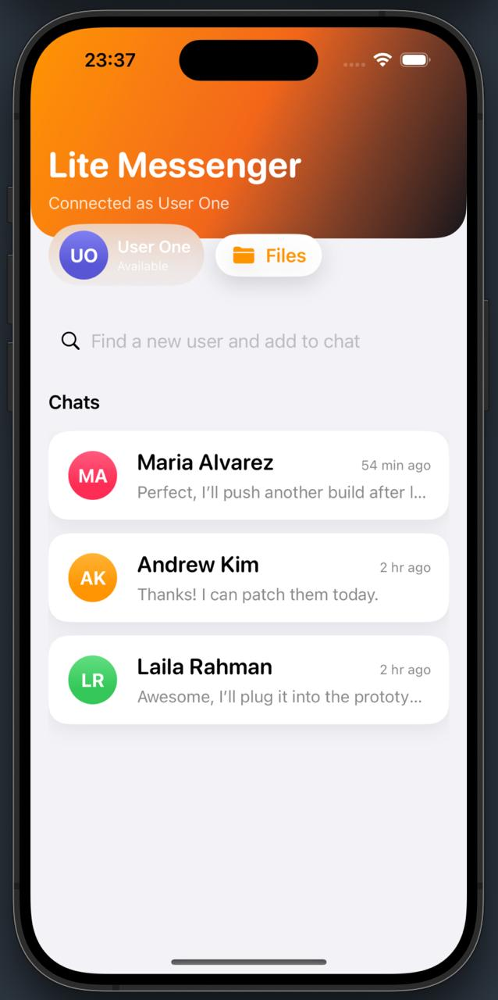
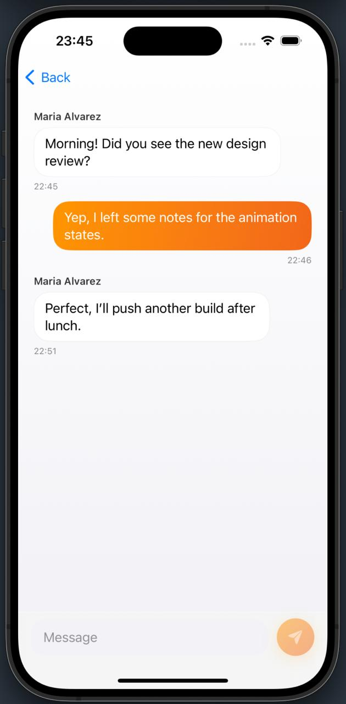

# Lite Messenger





End-to-end WebSocket chat demo consisting of:

- `backend/ktor-lite-messenger` – Ktor server (JWT auth, REST, WebSockets, Exposed/H2, avatar storage in the sibling `storage/` folder)
- `IOS/` – SwiftUI
- `storage/` – runtime avatar uploads (served by the backend at `/avatars/*`)

## Backend

```bash
cd backend/ktor-lite-messenger
./gradlew run
```

The server listens on `http://localhost:8158` and seeds five demo users (password `123456`). REST endpoints live under `/api`, and the WebSocket endpoint is `/ws/chat?token=<JWT>`.

## Mobile

Build the project in Xcode 
